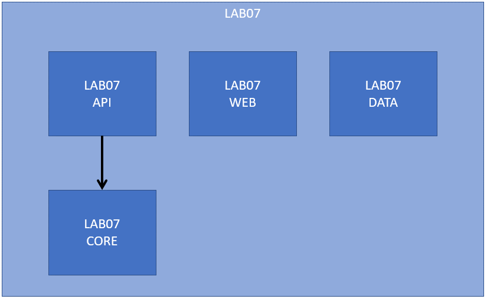
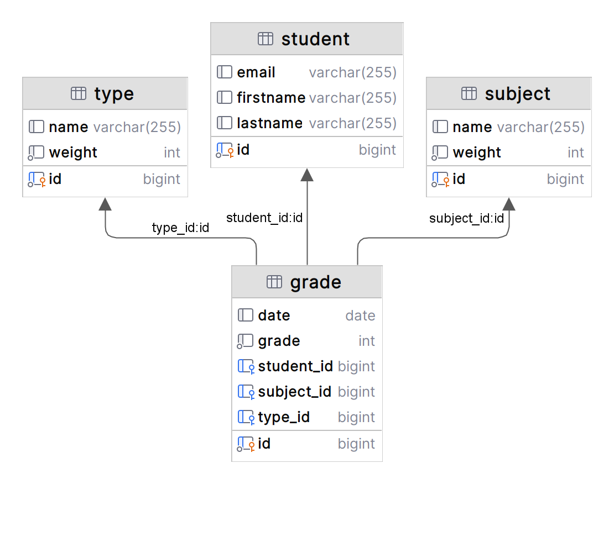

# LAB 07

DUTOIT Hugo & HERBECQ Baptiste

Welcome to the final lab!

For this lab, you'll have to complete the code with implementations and annotations. You can follow the `TODO`'s inside the different Maven modules.

## Functional requirements
You have a web application `lab07-web`, written with Spring Boot that renders HTML server-side, in order to manage a list of students with different grades for different subjects.

This web application is not directly plugged to a relational database. Indeed, it consumes a ReST API from another web application `lab07-api` that is written with Spring Boot as well.

## Maven Modules
The dependencies between the modules are the following:

## Entities
Inside the `lab07-core` module, you'll find 4 different entities:
- `Student` : A student with a lastname, a firstname, an email and a collection of `Subject` entities
- `Subject` : A subject with a name, a weight and a collection of `Grade` entities
- `Grade` : A grade with a value a date and a link to a `Type` entity (see below)
- `Type` : A type with a name and a weight

Here is the diagram of the tables in MySQL:

## Starting gifts
In order to make your life easier, you have been given a few things:
- a `lab07-data` module that contains an application able to populate your MySQL database. Do not worry if it does not compile, it just means that you have to implement your services and entities!
- the `StudentDAO` interface for Spring Data JPA, with tricky JPQL queries
- the `GradeService` class in which you'll find the methodes that save or update a grade in the database.

## Your tasks
Try to find the `TODO`'s in the different modules and complete the code with the right implementations and annotations.

Implements the controllers in the `lab07-api` module in order to expose the ReST API:

| Resource | URL                                                     | HTTP Verb | Description                                                                                                                                                                                                                                |
|----------|---------------------------------------------------------|:---------:|:-------------------------------------------------------------------------------------------------------------------------------------------------------------------------------------------------------------------------------------------|
| Student  | http://localhost:8081/students/                         |    GET    | Returns a collection of students with all their grades, subjects and types (refer to the `StudentDAO` interface).                                                                                                                          |
| Student  | http://localhost:8081/students/XX                       |    GET    | Returns a student with id XX, with all the grades, subjects and types.                                                                                                                                                                     |
| Grade    | http://localhost:8081/grades/XX                         |    GET    | Returns a grade with id XX.                                                                                                                                                                                                                |
| Grade    | http://localhost:8081/grades/XX                         |   POST    | Updates the grade XX with the Grade object provided in the body of the HTTP request.                                                                                                                                                       |
| Grade    | http://localhost:8081/grades/?studentId=XX&subjectId=YY |   POST    | Creates a new grade with the Grade object provided in the body of the HTTP request. You'll see that the `GradeService` has a `save` methods that takes a subjectId and studentId, these data are provided as request parameters in the url |
| Grade    | http://localhost:8081/grades/XX                         |  DELETE   | Delete a grade in the database.                                                                                                                                                                                                            |
| Subject  | http://localhost:8081/subjects/XX                       |    GET    | Returns a subject with id XX.                                                                                                                                                                                                              |
| Type     | http://localhost:8081/types/                            |    GET    | Returns a collection of all the types.                                                                                                                                                                                                     |

Please notice that the API application listens on port 8081, and the web application listens on port 8080!

## Logs
A good developper writes logs!

***Good luck*** 😉
